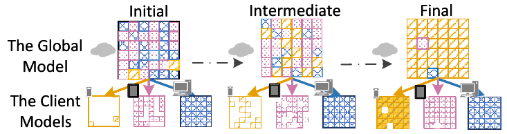
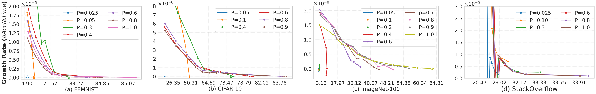
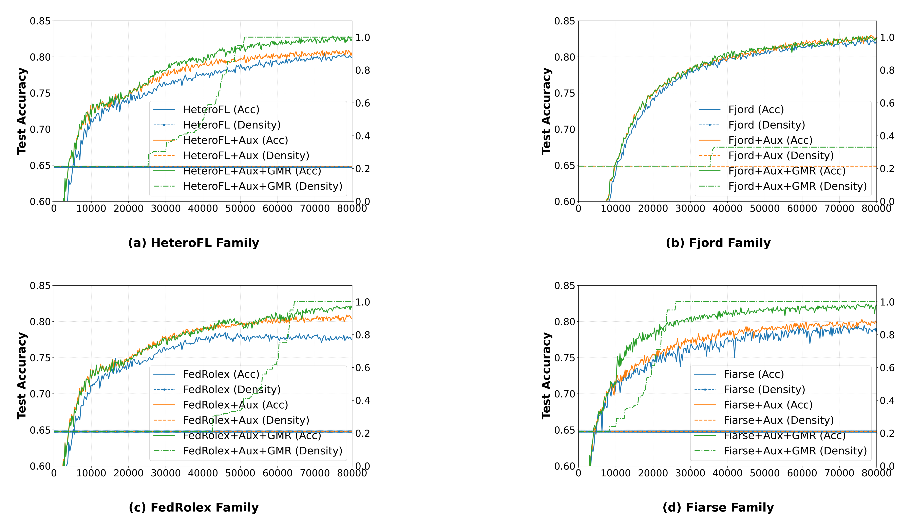
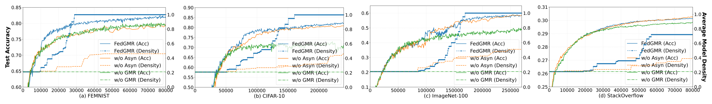
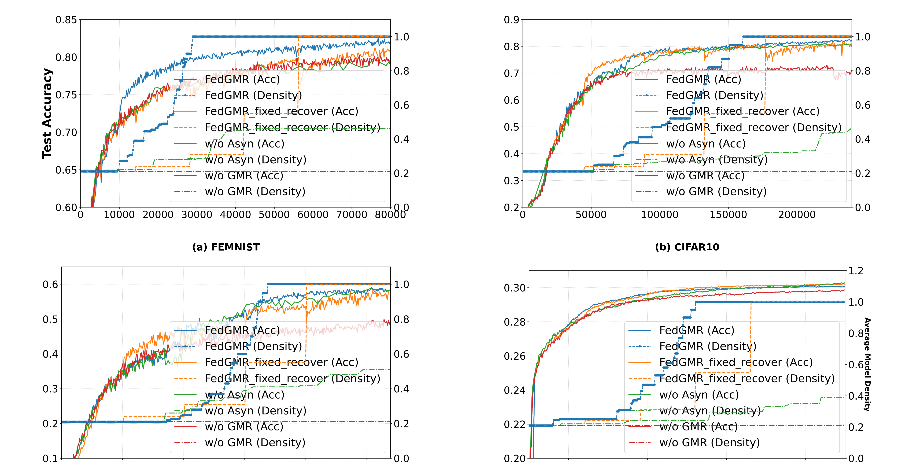

# Breaking the Capacity Bottleneck in Model-Heterogeneous Federated Learning via Gradual Model Restoration (Accepted at ICML 2026)

This project studies a stage-dependent problem in model-heterogeneous federated learning (MHFL): small sub-models help bandwidth-constrained clients participate efficiently in the early stage, but their contribution fades later as model capacity becomes the bottleneck. FedGMR addresses this issue through **Gradual Model Restoration (GMR)**, which progressively restores client model density during training so that bandwidth-constrained clients remain useful contributors in the late stage as well.

## Project Overview

In heterogeneous federated learning deployments, bandwidth-constrained clients often struggle to contribute effectively throughout training. Existing MHFL methods usually assign fixed small sub-models to weak clients to reduce communication and training cost. This works well early on, but fixed low-density sub-models become increasingly under-parameterized later in training, causing their updates to become weak, noisy, or uninformative.

FedGMR is built around a simple observation: **small sub-models are useful early, but should not stay fixed forever**. The framework gradually restores client model density during training, so the same resource-constrained clients can train quickly at first and still contribute meaningful updates later.

Around this core mechanism, the project also includes:

- asynchronous coordination for heterogeneous clients,
- mask-aware aggregation to stabilize restoration,
- empirical analysis of stage-dependent model utility,
- convergence analysis for MHFL under incomplete sub-model updates.

## Main Contributions

- **Stage-dependent MHFL insight.** We identify that fixed low-density sub-models are effective in the early stage but lose effectiveness later, even if they still allow frequent participation.
- **Gradual Model Restoration.** FedGMR progressively restores model density during training, re-activating bandwidth-constrained clients in the late stage.
- **Stability-aware aggregation.** Mask-aware aggregation is designed to better preserve gradient stability during restoration, making it more compatible with GMR than naive aggregation.
- **Theory for heterogeneous sub-model training.** The analysis characterizes the bias and variance introduced by incomplete client updates, highlights the role of average density and coverage, and shows that GMR narrows the optimization gap toward full-model FL.
- **Cross-method generality.** GMR is effective not only in the proposed framework but also when applied on top of other MHFL methods.

## Main Figures and Results

### 1. FedGMR framework and core idea

This is the main idea figure of the paper. FedGMR starts from the observation that bandwidth-constrained clients can benefit from small sub-models early, but should gradually recover model capacity later to remain useful global contributors.



### 2. Main baseline comparison under high heterogeneity

The table below summarizes the main baseline comparison from the paper under the hardest setting, where the gain from gradual restoration is most visible.

| Method | FEMNIST IID | FEMNIST Non-IID | CIFAR-10 IID | CIFAR-10 Non-IID | ImageNet-100 IID | ImageNet-100 Non-IID | StackOverflow IID | StackOverflow Non-IID |
|---|---:|---:|---:|---:|---:|---:|---:|---:|
| **FedGMR** | **82.67** | **81.86** | **84.52** | **81.68** | **60.84** | **58.01** | **30.00** | **30.07** |
| FedAvg | 75.62 | 74.64 | 70.75 | 68.46 | 48.65 | 47.46 | 24.38 | 24.38 |
| FedAsync | 81.34 | 81.03 | 82.86 | 79.28 | 58.19 | 55.36 | 25.86 | 25.83 |
| HeteroFL | 82.22 | 79.80 | 81.06 | 75.64 | 41.90 | 28.01 | 29.42 | 29.17 |
| FedRolex | 82.19 | 77.83 | 80.85 | 67.82 | 32.17 | 15.26 | 25.39 | 25.15 |
| FjORD | 82.59 | 81.85 | 81.79 | 81.34 | 41.18 | 32.93 | 29.18 | 27.73 |
| FIARSE | 81.22 | 78.77 | 74.04 | 69.19 | 54.00 | 48.27 | 28.77 | 28.57 |

Under high heterogeneity, FedGMR achieves the strongest gains on the hardest settings, especially on CIFAR-10 and ImageNet-100 under Non-IID splits. This is where fixed low-density sub-models suffer the most from late-stage capacity limits.

### 3. Stage-dependent benefit of model density

This figure illustrates the central empirical observation behind FedGMR: smaller sub-models improve faster early, while larger-capacity models become more beneficial later.



### 4. Cross-method gains from GMR

Applying GMR to multiple MHFL baselines consistently improves performance. This supports that the main contribution is the **restoration mechanism itself**, rather than one specific pruning rule or one specific base method.



These representative results show that adding GMR on top of different MHFL methods yields consistent improvements.

| Method | Base | +Aux | +Aux+GMR |
|---|---:|---:|---:|
| HeteroFL | 79.80 | 80.42 | 82.29 |
| FjORD | 81.76 | 82.16 | 82.20 |
| FedRolex | 77.83 | 80.36 | 81.58 |
| FIARSE | 78.77 | 79.56 | 81.97 |

### 5. Aggregation and ablation analysis

The ablation results highlight that restoration and aggregation are coupled: GMR improves late-stage usefulness, while mask-aware aggregation helps maintain stability during restoration.



In the paper, this figure is complemented by two appendix tables with the full numerical ablations. Those tables cover `w/o Asyn`, `w/o GMR`, `w/o Buff`, `w/o IMS`, and `w/o (Buff, IMS)` across IID/Non-IID splits and different heterogeneity levels, so the figure here should be read as a visual summary rather than the complete ablation record.

### 6. Robustness to restoration timing

FedGMR does not depend on one exact restoration trigger. A fixed-time restoration variant remains effective across datasets, although adaptive triggering can further improve some settings.



The fixed-time variant removes server-side early-stopping/stagnation triggering and restores directly according to training progress. It still improves over `w/o GMR`, which supports that the value of GMR does not depend on one exact trigger.

| Dataset | GMR (ES) | GMR (Fixed) | w/o Asyn | w/o GMR |
|---|---:|---:|---:|---:|
| FEMNIST | 81.71 ± 0.20 | 80.07 ± 0.32 | 78.80 ± 0.54 | 79.51 ± 0.35 |
| CIFAR-10 | 81.68 ± 0.28 | 80.42 ± 0.48 | 80.53 ± 0.20 | 71.93 ± 0.45 |
| ImageNet100 | 58.01 ± 0.50 | 56.38 ± 0.93 | 57.85 ± 1.50 | 48.28 ± 0.73 |
| StackOverflow | 30.04 ± 0.008 | 30.15 ± 0.018 | 30.11 ± 0.034 | 29.76 ± 0.019 |

## Repository Contents

This public release includes:

- core training and aggregation code,
- experiment scripts and configuration files,
- selected visualization assets under `figure/` and the minimal `FedGMR/` release folder, including the paper PDF,
- root-level notebooks used for plotting and result analysis,
- `control/` and `utils/` modules required by experiment entrypoints,
- `setenv.sh` for environment setup.

This public release excludes:

- paper source files (`.tex`, `.bib`, style files, submission-only assets),
- rebuttal documents and confidential review comments,
- large non-public result directories.

## How to Run

Before running any experiment, source the environment helper:

```bash
source setenv.sh
```

The public release expects `datasets/` to point to prepared data storage. In this release it is typically used as a lightweight placeholder or symlink target rather than a fully bundled data directory.

## Dataset Preparation

The first run of a dataset may trigger an automatic download or preprocessing step. If automatic download is not supported, place the raw files in the expected directory and rerun the same command; the code will then convert the raw data into the required format.

- `CIFAR10`: downloaded automatically through `torchvision`.
- `FEMNIST`: when `download=True`, the project clones LEAF and preprocesses FEMNIST automatically. If the raw data already exists, rerunning will process it into the required format.
- `StackOverflow`: if TensorFlow Federated is installed, the project can build `stackoverflow_train.pt`, `stackoverflow_val.pt`, and `stackoverflow_vocab.pt` automatically on first use.
- `ImageNet100`: automatic download is not provided. Please first download the original ILSVRC data from the official ImageNet/ILSVRC download page (e.g. https://image-net.org/challenges/LSVRC/2012/2012-downloads.php), place the extracted raw files under `datasets/ImageNet100/ILSVRC`, and rerun the same command. The code will then automatically convert the data into LMDB. Our `ImageNet100` setting uses the first **100** WordNet classes listed in `LOC_synset_mapping.txt`.

### Expected dataset directory structure

The repository expects a `datasets/` directory at the project root. In our public release, this is typically a symlink to shared storage, but the logical structure should look like:

```text
datasets/
├── CIFAR10/
├── FEMNIST/
│   ├── raw/
│   └── processed/
├── ImageNet100/
│   ├── ILSVRC/                  # manually placed raw files
│   ├── imagenet100_train.lmdb/  # generated automatically
│   └── imagenet100_val.lmdb/    # generated automatically
└── stackoverflow/
    ├── stackoverflow_train.pt
    ├── stackoverflow_val.pt
    └── stackoverflow_vocab.pt
```

Practical behavior by dataset:

- `CIFAR10`
  - Can be downloaded automatically.
  - No extra manual raw-data step is needed in normal use.
- `FEMNIST`
  - Can be downloaded and preprocessed automatically through LEAF.
  - If the raw files already exist, rerunning will convert them into `processed/`.
- `ImageNet100`
  - Raw files must be placed manually under `datasets/ImageNet100/ILSVRC`.
  - The source is the original ILSVRC/ImageNet release.
  - This project constructs `ImageNet100` by taking the first **100** classes from `LOC_synset_mapping.txt`.
  - The LMDB files are generated automatically on rerun.
- `StackOverflow`
  - Automatic preprocessing is supported if TensorFlow Federated is installed.
  - The generated `.pt` and vocabulary files are then reused by training scripts.

This means the general rule is:

- if automatic download is supported, the first run can prepare the dataset directly;
- if automatic download is not supported, place the raw files once and rerun the same command;
- if an intermediate format such as `processed/` or `lmdb/` is missing, the code will build it on first use.

## Experiment Entry Points

The repository contains many scripts, but they are not all meant for the same purpose. The recommended split is:

- **Main comparison experiments**
  - `experiments/CIFAR10/Prune_increase_FL_CMD.py`
  - `experiments/FEMNIST/Prune_increase_FL_CMD.py`
  - `experiments/ImageNet100/Prune_increase_FL_CMD.py`
  - `experiments/stackoverflow/Prune_increase_FL_CMD.py`
- **Ablation experiments**
  - `experiments/CIFAR10/Ablation_Prune_increase_FL_CMD.py`
  - `experiments/FEMNIST/Ablation_Prune_increase_FL_CMD.py`
  - `experiments/ImageNet100/Ablation_Prune_increase_FL_CMD.py`
  - `experiments/stackoverflow/Ablation_Prune_increase_FL_CMD.py`
  - `experiments/stackoverflow/Ablation_Prune_increase_FL_CMD2.py`
- **Baseline variants / specialized entrypoints**
  - `Syn_modelhetero.py`, `fjord.py`, and related method-specific scripts
  - these are used for baseline reproduction or method-specific comparisons
- **Notebooks**
  - the root-level notebooks are mainly for plotting, result organization, and analysis
  - they are not the primary training entrypoints

If you only want to reproduce the main paper results, start from:

- the dataset-specific `autorun/*.sh` files for command templates, and
- the corresponding `Prune_increase_FL_CMD.py` entrypoints for actual runs.

## Example Commands

The commands below are representative examples extracted from the existing `autorun/*.sh` scripts and the notebook-based comparison sweeps.

### CIFAR10

```bash
source setenv.sh
python experiments/CIFAR10/Prune_increase_FL_CMD.py -i 50 -ex fed_asyn -ac wg -num_clients 10 -sample_client medium -patience 5 -niid
python experiments/CIFAR10/Ablation_Prune_increase_FL_CMD.py -i 50 -ex wo_gmr -ac wg -num_clients 10 -sample_client medium -patience 5 -niid
```

Ablation-style examples from the shell scripts use the same patience values as the paired comparison settings:

```bash
python experiments/CIFAR10/Ablation_Prune_increase_FL_CMD.py -i 50 -ex wo_gmr -ac wg -num_clients 10 -sample_client medium -patience 5 -niid
python experiments/CIFAR10/Ablation_Prune_increase_FL_CMD.py -i 50 -ic 2.0 -ex wo_asyn -num_clients 10 -sample_client medium -patience 25 -bp
python experiments/CIFAR10/Ablation_Prune_increase_FL_CMD.py -i 50 -ic 2.0 -ex mask_fed_avg -num_clients 10 -sample_client medium -patience 25 -bp
python experiments/CIFAR10/Ablation_Prune_increase_FL_CMD.py -i 50 -ic 2.0 -ex gradient_avg -num_clients 10 -sample_client medium -patience 25 -bp
python experiments/CIFAR10/Ablation_Prune_increase_FL_CMD.py -i 50 -ic 2.0 -ex re_gradient_avg -num_clients 10 -sample_client medium -patience 25 -bp -re
```

The notebook-based CIFAR10 comparison sweep uses the following patience settings:

- IID:
  - high: `FedGMR` `10`, `fed_avg` `5`, `fed_asyn` `5`, `heterofl` `5`, `fedrolex` `5`, `fjord` `5`, `fiarse` `10`
  - medium: `FedGMR` `25`, `fed_avg` `5`, `fed_asyn` `5`, `heterofl` `5`, `fedrolex` `5`, `fjord` `5`, `fiarse` `10`
  - low: `FedGMR` `1`, `fed_asyn` `5`, `heterofl` `5`, `fedrolex` `5`, `fjord` `5`, `fiarse` `10`
- Non-IID:
  - high: `FedGMR` `15`, `fed_avg` `5`, `fed_asyn` `5`, `heterofl` `5`, `fedrolex` `5`, `fjord` `5`, `fiarse` `10`
  - medium: `FedGMR` `30`, `fed_avg` `5`, `fed_asyn` `5`, `heterofl` `5`, `fedrolex` `5`, `fjord` `5`, `fiarse` `10`
  - low: `FedGMR` `1`, `fed_avg` `5`, `fed_asyn` `5`, `heterofl` `5`, `fedrolex` `5`, `fjord` `5`, `fiarse` `10`

### FEMNIST

```bash
source setenv.sh
python experiments/FEMNIST/Prune_increase_FL_CMD.py -i 25 -ex FedGMR -num_clients 10 -sample_client high -patience 5 -niid -bp --recover_step_mode fixed --recover_step 0.1
python experiments/FEMNIST/Prune_increase_FL_CMD.py -i 25 -ex gmr_fiarse -num_clients 10 -sample_client high -patience 10 -niid -bp --recover_step_mode ladder
```

Ablation-style FEMNIST examples from the shell scripts also keep the same patience as the paired runs:

```bash
python experiments/FEMNIST/Ablation_Prune_increase_FL_CMD.py -i 25 -ex wo_gmr -num_clients 10 -sample_client high -patience 5 -niid -bp
python experiments/FEMNIST/Ablation_Prune_increase_FL_CMD.py -i 25 -ic 2.0 -ex wo_asyn -num_clients 10 -sample_client high -patience 7 -niid -bp
python experiments/FEMNIST/Ablation_Prune_increase_FL_CMD.py -i 25 -ic 2.0 -ex mask_fed_avg -num_clients 10 -sample_client high -patience 7 -niid -bp
python experiments/FEMNIST/Ablation_Prune_increase_FL_CMD.py -i 25 -ic 2.0 -ex gradient_avg -num_clients 10 -sample_client high -patience 7 -niid -bp
python experiments/FEMNIST/Ablation_Prune_increase_FL_CMD.py -i 25 -ic 2.0 -ex re_gradient_avg -num_clients 10 -sample_client high -patience 7 -niid -bp -re
```

The notebook-based FEMNIST comparison sweep uses the following patience settings:

- IID:
  - high: `FedGMR=5`, `fed_avg=5`, `fed_asyn=5`, `heterofl=5`, `fedrolex=10`, `fjord=5`, `fiarse=5`
  - medium: `FedGMR=5`, `fed_avg=5`, `fed_asyn=5`, `heterofl=5`, `fedrolex=10`, `fjord=5`, `fiarse=5`
  - low: `FedGMR=3`, `fed_avg=5`, `fed_asyn=5`, `heterofl=5`, `fedrolex=10`, `fjord=5`, `fiarse=5`
- Non-IID:
  - high: `FedGMR=7`, `fed_avg=5`, `fed_asyn=5`, `heterofl=5`, `fedrolex=10`, `fjord=5`, `fiarse=5`
  - medium: `FedGMR=3`, `fed_avg=5`, `fed_asyn=5`, `heterofl=5`, `fedrolex=10`, `fjord=5`, `fiarse=5`
  - low: `FedGMR=1`, `fed_avg=5`, `fed_asyn=5`, `heterofl=5`, `fedrolex=10`, `fjord=5`, `fiarse=5`

### ImageNet100

```bash
source setenv.sh
python experiments/ImageNet100/Prune_increase_FL_CMD.py -i 50 -ex FedGMR -ac wg -num_clients 10 -sample_client medium -patience 5 -niid
python experiments/ImageNet100/Prune_increase_FL_CMD.py -i 50 -ex heterofl -ac wg -num_clients 10 -sample_client medium -patience 10
```

Ablation-style ImageNet100 examples from the shell scripts keep the same patience as the paired runs:

```bash
python experiments/ImageNet100/Ablation_Prune_increase_FL_CMD.py -i 50 -ex buff -ac wg -num_clients 10 -sample_client medium -patience 5 -niid
python experiments/ImageNet100/Ablation_Prune_increase_FL_CMD.py -i 50 -ex mask_fed_avg -ac wg -num_clients 10 -sample_client medium -patience 5 -niid
python experiments/ImageNet100/Ablation_Prune_increase_FL_CMD.py -i 50 -ex wo_asyn -ac wg -num_clients 10 -sample_client medium -patience 5 -niid
python experiments/ImageNet100/Ablation_Prune_increase_FL_CMD.py -i 50 -ex wo_gmr -ac wg -num_clients 10 -sample_client medium -patience 10 -niid
```

The notebook-based ImageNet100 comparison sweep uses the following `FedGMR` patience settings:

- IID:
  - high: `40`
  - medium: `30`
  - low: `40`
- Non-IID:
  - high: `25`
  - medium: `30`
  - low: `30`

The remaining baselines in the notebook use the exact experiment names shown in the notebook cells, while `FedGMR` is the one that explicitly encodes patience.

### StackOverflow

```bash
source setenv.sh
python experiments/stackoverflow/Prune_increase_FL_CMD.py -i 25 -ex FedGMR -num_clients 10 -sample_client high -patience 7 -niid -bp --recover_trigger_mode time --recover_time_total 70000 --recover_time_points 0.2,0.4,0.6,0.8,1.0 --recover_time_ladder 0.05,0.1,0.2,0.5,1.0
python experiments/stackoverflow/Prune_increase_FL_CMD.py -i 25 -ex FedGMR -num_clients 10 -sample_client high -patience 10 -niid
```

Ablation-style StackOverflow examples from the notebook use the same patience grid as the comparison sweep:

```bash
python experiments/stackoverflow/Prune_increase_FL_CMD.py -i 25 -ex gmr_fiarse -num_clients 10 -sample_client high -patience 7 -niid -bp --recover_trigger_mode time --recover_time_total 70000 --recover_time_points 0.2,0.4,0.6,0.8,1.0 --recover_time_ladder 0.05,0.1,0.2,0.5,1.0
python experiments/stackoverflow/Prune_increase_FL_CMD.py -i 25 -ex FedGMR -num_clients 10 -sample_client high -patience 10 -niid
python experiments/stackoverflow/Syn_modelhetero.py -i 25 -ex heterofl -num_clients 10 -sample_client low -patience 5 -niid
python experiments/stackoverflow/Syn_modelhetero.py -i 25 -ex fjord -num_clients 10 -sample_client low -patience 5 -niid
```

The notebook-based StackOverflow comparison sweep uses the following `FedGMR` patience settings:

- IID:
  - high: `15`
  - medium: `20`
  - low: `8`
- Non-IID:
  - high: `10`
  - medium: `10`
  - low: `20`

As above, the other baselines use the explicit experiment names from the notebook cells, and `FedGMR` is the one that varies the patience value directly.

## Notes

- This release is intended to reproduce the public code, experiment setup, and sharable figures behind FedGMR.
- If you want a narrower release, edit `make_public_release.py` and adjust the include/exclude rules.
